# Things about K8S you must know!

## SSL/TLS Configuration in Ingress:  
You need to create a secret of type tls and provide the tls.crt and tls.key in the data block.  
  

Configure it in the Ingress.yml file as below:  

**Flow of the HTTPS Request**  

## Deployment Strategies in K8S  

### Rolling Update  
--> Apply in the deployment.yml file under strategy. Create new pods with updated code, wait till its ready and then remove the old pod. makes sure at least N pods are always running.   
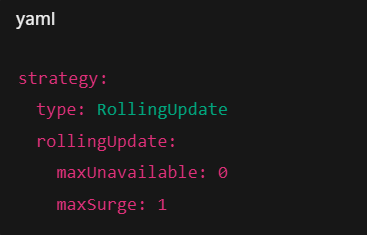

### Blue Green Deployment  
--> Create two deployment.yml files.  
1. app-blue  (current deployment)
2. app-green (new deployment)

Initiall the service will be having app-blue under selector, so the traffic will be routed to the current live server. Meanwhile deploy the new deployment app-green and validate it internally (without sending the actual traffic)  
  

Point the service to new deployment app-green using selector. Test it correctly and if something goes wrong, change the service pointing back to app-blue. 
  
  

### Canary Deployment  
--> The traffic is moved to the new updated deployment gradually, not all at once.  
Assuming the stable version is deployed and running.  
  

Service of this version is below  
  

Now to deploy new version via canary deployment, we define a new deployment.yml file with version as v2 and new service as well pointing to the new v2 version deployment.  
  

  

Now the main ingress should look like the below which is pointing to stable version as of now and sends 100 % traffic
  

Now create a new Canary Ingress with annotations having the canary weight to send 10 % of traffic to the new update version v2 deployment.  

Increase the traffic gradually and test accordingly and once 100% traffic is comming from new Canary deployment, the new version deployment is being served fully.

### Key Config for Zero Downtime  
Configure readiness probe in the deployment. By doing this traffic is sent to only healthy pods.  
  

## Rollback strategies in Kubernetes  

### Using Deployment  
In real Kubernetes clusters, rollback is mainly handled by Deployments. Kubernetes keeps old versions (ReplicaSets) so you can go back if a rollout fails.
**Every time you update a Deployment:**  
Kubernetes creates a new ReplicaSet  
Old ReplicaSets are kept (by default last 10)  
Each ReplicaSet = one version of your app 

  

### Using Helm  
When you deploy using Helm, rollback is handled at the Helm release level.
Helm tracks every install/upgrade as a release revision and lets you go back to any previous revision.  

We can check the history via  
helm history myapp  

  

  

## Network Security and access control  
--> We can configure RBAC  
  

--> We can use serviceaccount  
  
  

Now all pods in this Deployment use identity = app-sa.  
Post this, we can create a Role with required access and bind it with the serviceaccount.  
  
  

--> We can define Network Policies  
  

--> We can enable security at Ingress level  
  

## kubectl commands 
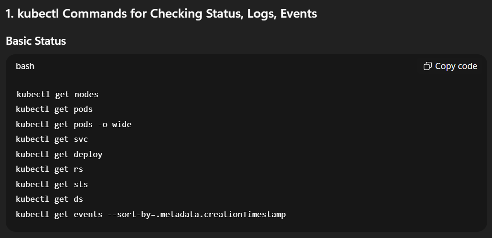  

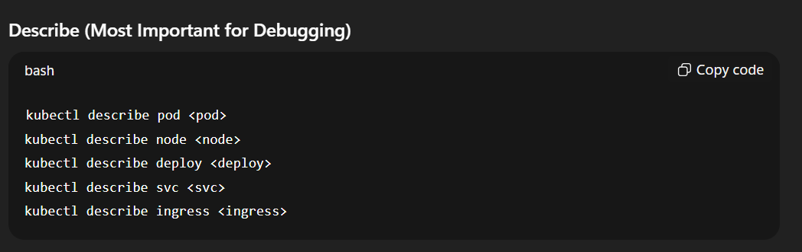  

The above describe command shows  
--Events  
--Scheduling issues  
--Image errors  
--Probe failures  

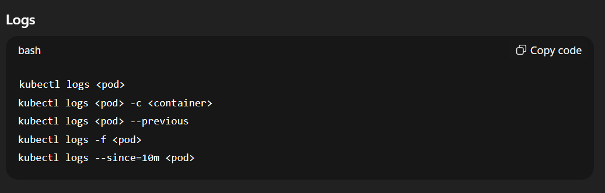  

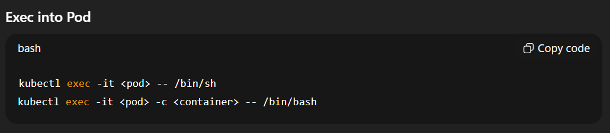  

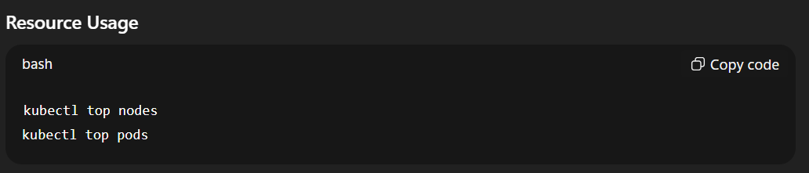 

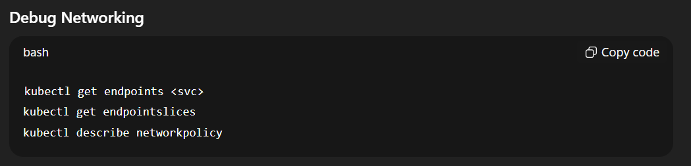  

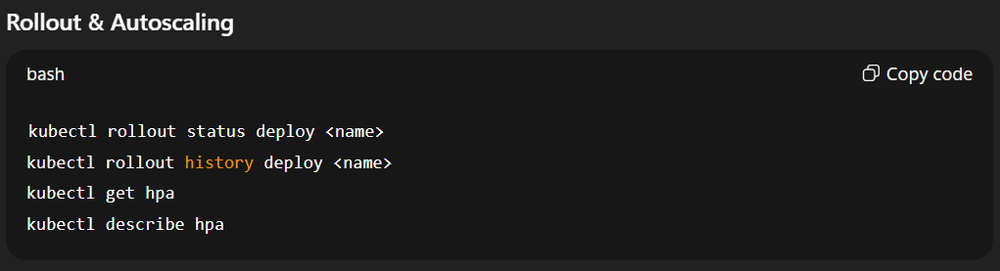

## Common K8S Errors  
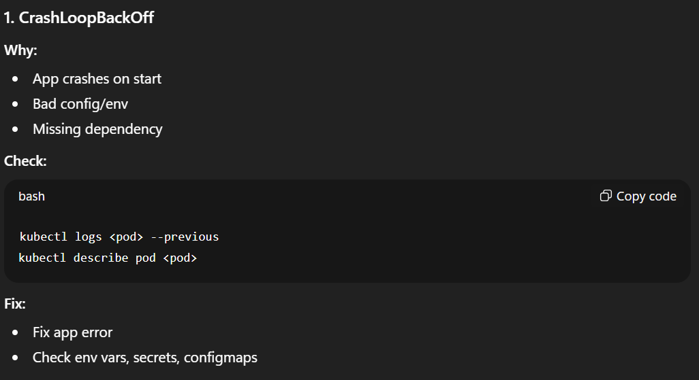  

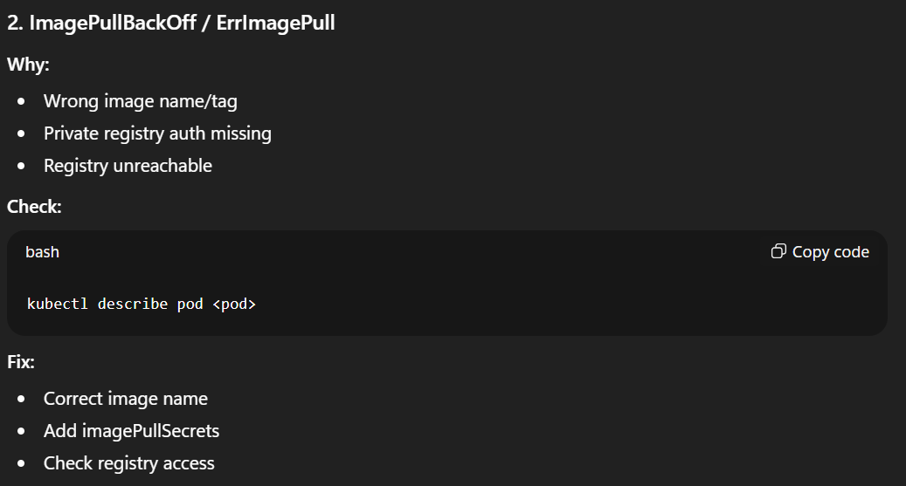  

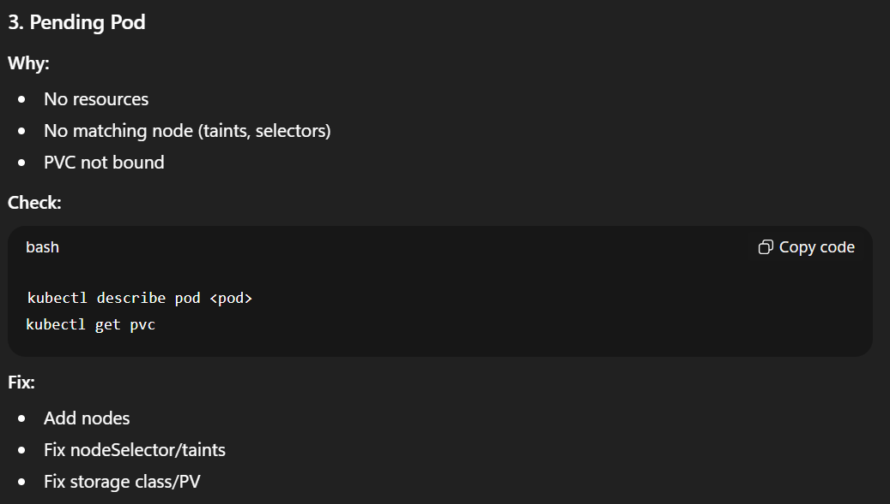  

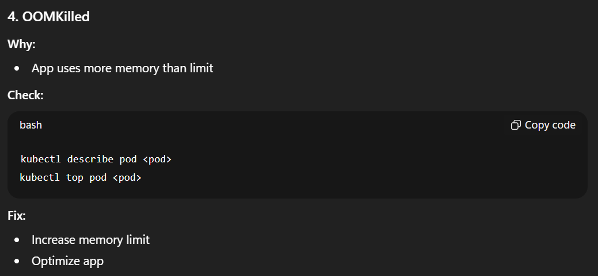  

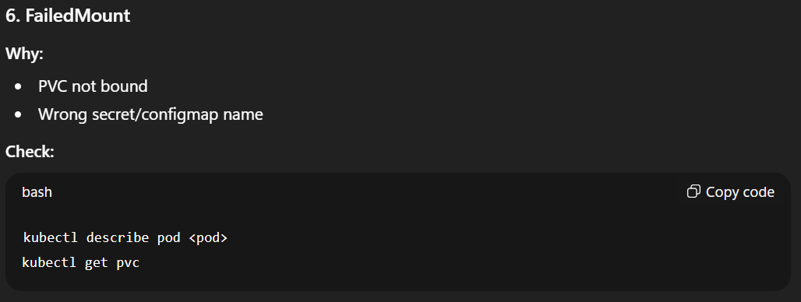  

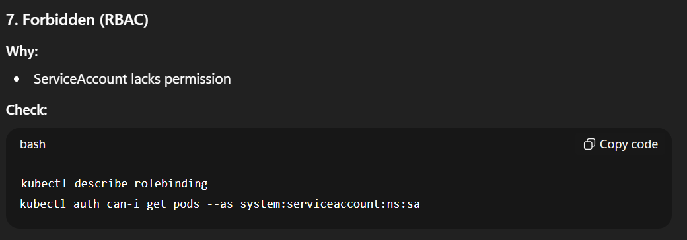  

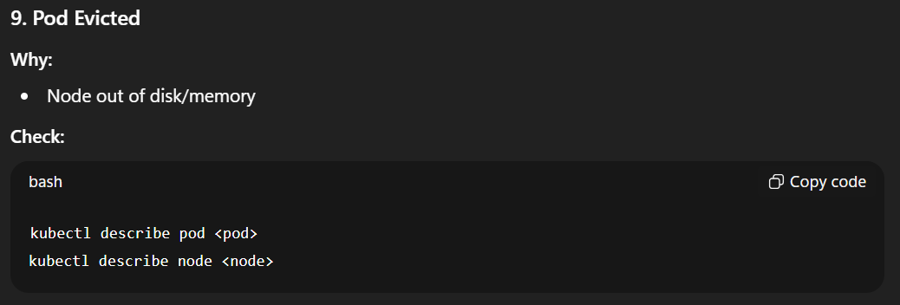  

**--> Quick Debug Flow**  
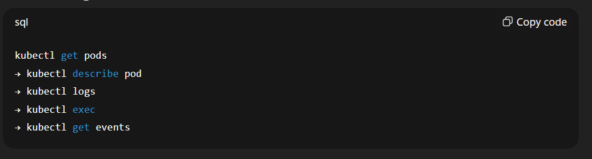  

## Taints and Tolerations  
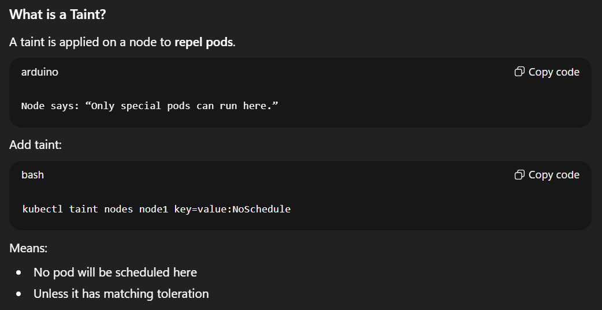  

## Node Affenity  
Using Node affenity, we can tell k8s to place a pod on a specific node if it matched a perticular lable or a pattern  
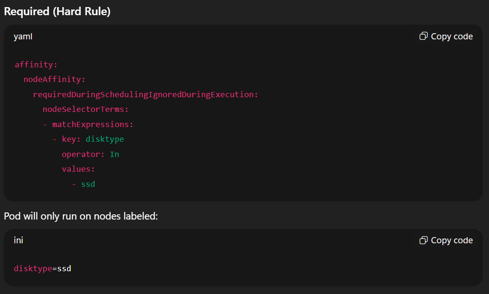  

## Readiness and Liveness Probe  
### Rediness
It allows to let k8s now if a pod is allowed and ready to handle traffic or not.  
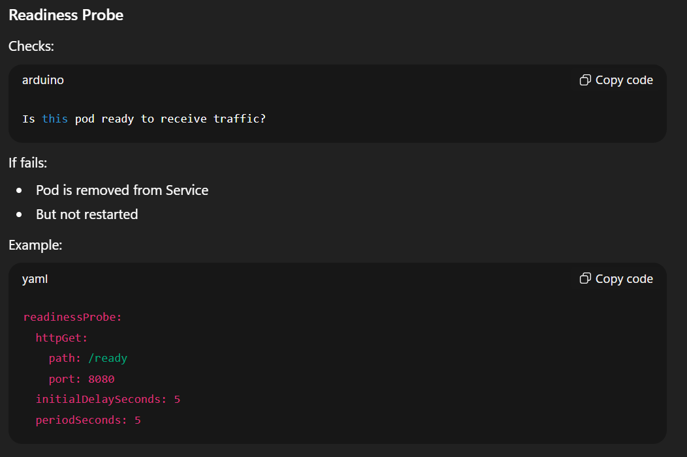  

### Liveness  
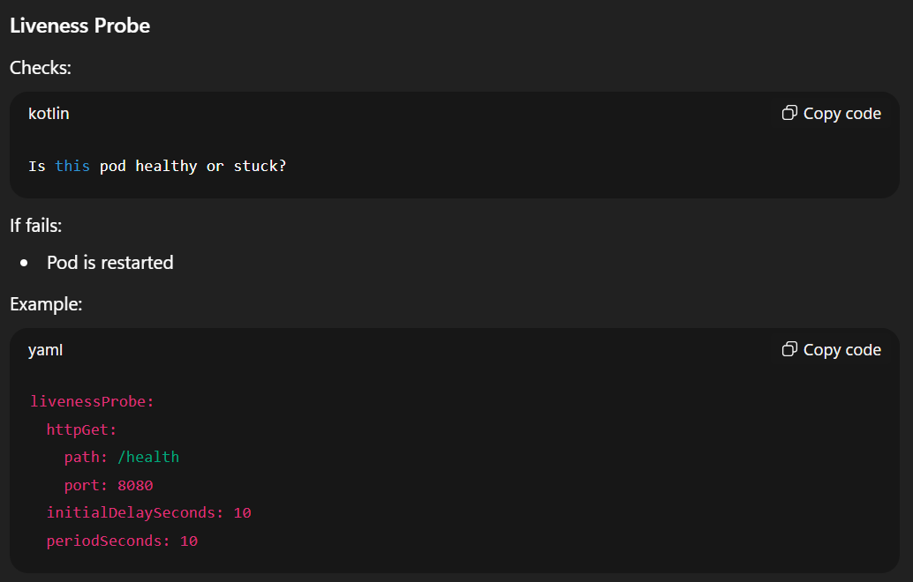  

